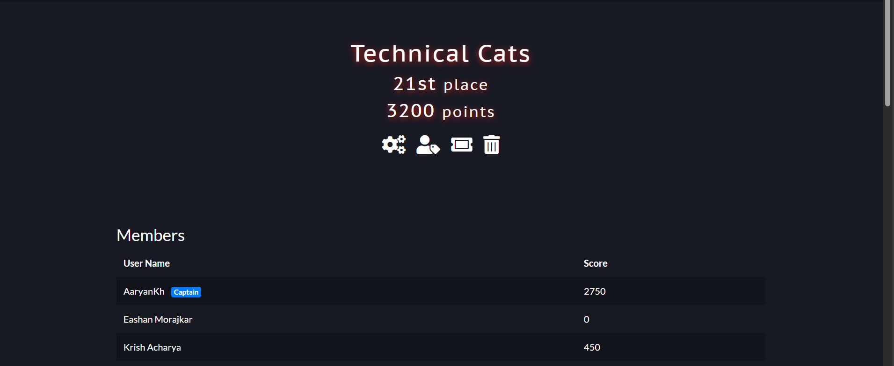
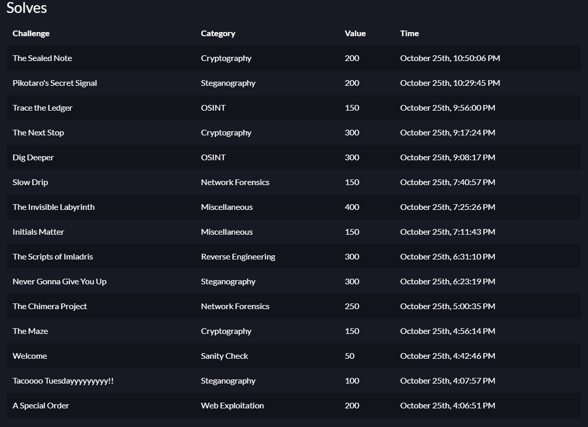

# CyberTea CTF Round 1
Organized by IIIT Sricity @ 25th October, 2025.

## Prerequisite Tools
1. [A Special Order](./A%20Special%20Order/)
> No prerequisites as this challenge is web-based.

2. [Dig Deeper](./Dig%20Deeper/)
> Requires `exiftool` for location detection.

3. [Initials Matter](./Initials%20Matter/)
> No prerequisites as this challenge is self-contained.

4. [Never Gonna Give You Up](./Never%20Gonna%20Give%20You%20Up/)
> `zsteg` is required for the steganography analysis and then an image merging tool.

5. [Pikotaro's Secret Signal](./Pikotaro's%20Secret%20Signal/)
> `sonic-visualiser` is required for the audio analysis.

6. [Slow Drip](./Slow%20Drip/)
> `wireshark` is required for packet analysis.

7. [Tacoooo Tuesdayyyyyyyyy!!](./Tacoooo%20Tuesdayyyyyyyyy!!)
> `exiftool` is required to extract comment metadata.

8. [The Chimera Project](./The%20Chimera%20Project/)
> No prerequisites as `strings` is included in most Unix-like systems.

9. [The Invisible Labyrinth](./The%20Invisible%20Labyrinth/)
> Simple `grep *` will work with a base64 encoded string for `CTEA_CTF{`.

10. [The Maze](./The%20Maze/)
> An online Vigenère cipher tool can be used for decryption.

11. [The Next Stop](./The%20Next%20Stop/)
> No prerequisites.

12. [The Scripts of Imladris](./The%20Scripts%20of%20Imladris/)
> Knowledge of `Lord of the Rings` lore may be helpful.

13. [The Sealed Note](./The%20Sealed%20Note/)
> Knowledge of `RSA decryption` is required.

14. [Trace The Ledger](./Trace%20The%20Ledger/)
> No prerequisites.

15. [Welcome](./Welcome/)
> A simple `grep *` is sufficient for this challenge.

```bash
sudo apt install binwalk exiftool ruby wireshark sonic-visualiser

sudo gem install zsteg
```

## Statistics
- Solved Problems: 15 / 15
- Final Position: 21 / 109
- Total Points: 3200 / 3200 (No Hints Used)



