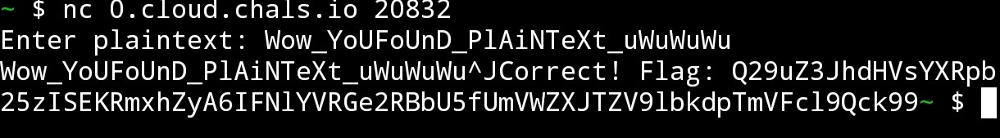

# Black Pearl’s Cursed Cipher
From SeaTF @ NITK, 2025.

## Problem Statement:
Ahoy matey! Set sail on the perilous digital seas and dare to conquer the cursed binary to seize Captain Blackbeard’s secret flag! But beware—the dark sorcery of encrypted lore hides the treasure, and only the cleverest pirates shall prevail. To unlock the binary’s secrets, ye must first solve this ancient riddle:

Ciphertext: `Hjg_KiFTyVaO_KvMcYHoYg_fReIoHi` In a chest of secrets, the key awaits— Use `BLACKBEARD` to unlock the gates. Then shift each letter back by ten, so true— And the treasure will reveal its clue to you!

Use this command to run the file `nc -v 0.cloud.chals.io 20832`

## My Approach / Solution:
1. The given ciphertext is `Hjg_KiFTyVaO_KvMcYHoYg_fReIoHi`
2. The cipher is identified to be `Vigenère Cipher` with the key `BLACKBEARD`.
3. On running the script `./vigenere.py` to decrypt the ciphertext, the output was found to be `Wow_YoUFoUnD_PlAiNTeXt_uWuWuWu`.
4. The output was then passed onto the netcat command to get the output `Q29uZ3JhdHVsYXRpb25zISEKRmxhZyA6IFNlYVRGe2RBbU5fUmVWZXJTZV9lbkdpTmVFcl9Qck99`, which was quickly identified to be a base64 encoded string.

5. On decoding the base64 encoded string, the flag was found to be `Congratulations!!\nFlag : SeaTF{dAmN_ReVerSe_enGiNeEr_PrO}`.

## Flag:
```
SeaTF{dAmN_ReVerSe_enGiNeEr_PrO}
```